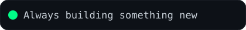
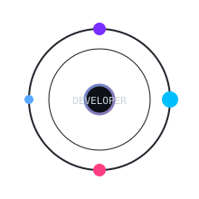

  

## 🚀 About Me

- 🧠 Building AI-powered tools and full-stack applications
- 🎓 Engineering student at Saveetha School of Engineering, SIMATS
- 🔭 Working on **TimeAudit** (AI productivity SaaS) & **MathCore** (AI math learning platform)
- 🤖 Creator of **morpheus** — a self-evolving execution intelligence system
- ⚡ Fun fact: I name my projects like they're sci-fi characters

## 🛠️ Tech Stack

## 📈 GitHub Stats

## 🧰 Top Languages

## 📈 Contribution Graph

## 🐍 Snake Game

## ✨ Powered By

---

  <i>Thanks for visiting! Come back anytime 😄</i>
   
  

